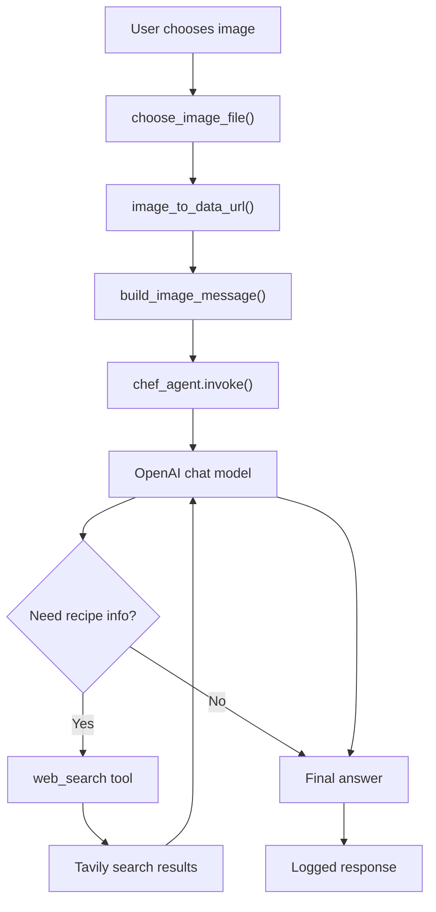

# Personal Chef Agent With LangChain

> A multimodal LangChain agent that looks at a food or ingredient image, identifies what is in it, searches the web with Tavily, and suggests recipe ideas using an OpenAI chat model.

[](https://www.python.org/)
[](https://www.langchain.com/)
[](https://platform.openai.com/)
[](https://www.tavily.com/)
[](https://www.langchain.com/langgraph)
[](#architecture)

---

## What Is This?

This project is a small personal AI chef assistant built with **LangChain**.

The app lets you choose a local image of food, groceries, pantry items, or ingredients. It converts that image into a multimodal message, sends it to an OpenAI chat model, and gives the model access to a Tavily-powered web search tool so it can look up recipe ideas based on what it sees.

The goal is simple:

```text
Take an ingredient image -> understand the ingredients -> search for recipes -> suggest what to cook next
```

This is a learning-focused agent project. It keeps the code intentionally compact while showing the core pieces of an AI agent workflow: model setup, system prompting, tool registration, image input, web search, environment variables, logging, and a LangGraph configuration file.

> **Important:** This project uses external APIs. Your selected image and prompt are sent to the configured OpenAI model provider, and search queries are sent to Tavily. Your `.env` file is ignored by Git and should never be committed.

| File | Responsibility |
|---|---|
| `main.py` | Creates the chat model, builds the LangChain agent, asks for an image, invokes the agent, and logs the response |
| `prompts.py` | Stores the chef system prompt used to guide the assistant |
| `tools.py` | Defines the Tavily web search tool exposed to the agent |
| `uploading_images_to_agents.py` | Handles image selection, image validation, base64 encoding, and multimodal message construction |
| `langgraph.json` | LangGraph configuration for loading the exported `chef_agent` |
| `pyproject.toml` | Project metadata, Python version, and dependencies |
| `uv.lock` | Locked dependency versions for reproducible installs with `uv` |

---

## Application Modes

### Local Image Agent

Run the app from the terminal:

```bash
python main.py
```

The app opens a local file picker. Choose an image such as:

- vegetables on a table
- pantry ingredients
- leftovers in a container
- a fridge or grocery photo
- a dish you want to recreate

If a graphical file picker is not available, the app falls back to a terminal prompt:

```text
Image path:
```

After you choose an image, the agent analyzes the image, searches the web for recipe ideas, and logs the final answer.

---

### LangGraph Configuration

The repository also includes a `langgraph.json` file:

```json
{
    "dependencies": ["."],
    "graphs": {
        "agent": "./main.py:chef_agent"
    },
    "env": "./.env"
}
```

This is useful for experimenting with the exported `chef_agent` in a LangGraph-compatible workflow.

---

## Feature List

### Multimodal Agent

- Accepts a local image file as input
- Supports common image formats such as PNG, JPG, JPEG, and WebP
- Validates that the selected file exists and is an image
- Converts the image to a base64 data URL
- Builds a LangChain `HumanMessage` containing both text and image content
- Sends the image and prompt to a vision-capable OpenAI chat model

### Web Search Tool

- Defines a LangChain tool with the `@tool` decorator
- Uses Tavily as the search provider
- Lets the agent search for recipes, cooking ideas, and ingredient context
- Returns Tavily search results directly to the agent
- Logs when the agent starts a web search

### Agent Orchestration

- Uses `create_agent` from LangChain
- Registers the Tavily search tool with the model
- Uses a chef-focused system prompt
- Invokes the agent with the image message
- Logs model creation, agent creation, invocation, and response output

### Configuration

- Uses `.env` for API keys
- Keeps secrets out of Git through `.gitignore`
- Uses `pyproject.toml` for dependencies
- Uses `uv.lock` for reproducible dependency resolution
- Includes `langgraph.json` for LangGraph experimentation

---

## How It Works

1. **Environment loading.** `tools.py` calls `load_dotenv()` so API keys from `.env` are available to OpenAI and Tavily integrations.

2. **Model creation.** `main.py` creates a chat model with `init_chat_model(model="gpt-5-nano")`.

3. **Tool setup.** `tools.py` creates a `TavilyClient` and wraps its search method in a LangChain tool called `web_search`.

4. **Agent creation.** `main.py` creates a LangChain agent with the model, the Tavily web search tool, and the chef system prompt.

5. **Image selection.** `choose_image_file()` opens a Tkinter file picker. If that fails, it asks for an image path in the terminal.

6. **Image encoding.** `image_to_data_url()` verifies the file, detects its MIME type, reads the bytes, and converts the image to a base64 data URL.

7. **Message construction.** `build_image_message()` creates a multimodal `HumanMessage` with prompt text and image content.

8. **Agent invocation.** `chef_agent.invoke()` sends the message to the agent.

9. **Tool use.** The agent can call `web_search()` when it needs recipe ideas or cooking information from the web.

10. **Output.** The final response is printed through the logging system.

---

## Architecture

```text
+-------------------------------------------------------------+
|                         main.py                             |
|                                                             |
|  init_chat_model("gpt-5-nano")                              |
|  create_agent(model, tools, system_prompt)                  |
|  choose image -> build message -> invoke agent              |
+-------------------------------+-----------------------------+
                                |
                                v
+-------------------------------------------------------------+
|                       chef_agent                            |
|                                                             |
|  LangChain agent with chef prompt and web search tool       |
+-------------------------------+-----------------------------+
                                |
                +---------------+---------------+
                |                               |
                v                               v
+------------------------------+   +--------------------------+
|  uploading_images_to_agents  |   |         tools.py         |
|                              |   |                          |
|  Tkinter file picker         |   |  TavilyClient            |
|  terminal fallback           |   |  @tool web_search        |
|  MIME validation             |   |  web recipe lookup       |
|  base64 image data URL       |   |                          |
+--------------+---------------+   +------------+-------------+
               |                                |
               v                                v
        Local image file                  Tavily Search API
               |
               v
+-------------------------------------------------------------+
|                    OpenAI Chat Model                        |
|                                                             |
|  Reads prompt + image, uses tools, returns cooking advice    |
+-------------------------------------------------------------+
```

Here is the agent flow from image to recipe suggestion:



---

## Project Structure

```text
Personal_Agent_Chef_With_LangChain/
|
|-- main.py                         # Local entry point and agent invocation
|-- prompts.py                      # Chef system prompt
|-- tools.py                        # Tavily web search LangChain tool
|-- uploading_images_to_agents.py   # Image picker and multimodal message helpers
|-- langgraph.json                  # LangGraph agent configuration
|-- pyproject.toml                  # Project metadata and dependencies
|-- uv.lock                         # Locked dependency versions
|-- .python-version                 # Python version marker
|-- .gitignore                      # Ignores .env, .venv, cache files, and local files
`-- README.md                       # Project documentation
```

---

## Getting Started

### Prerequisites

| Requirement | Notes |
|---|---|
| Python 3.12+ | Project is configured for Python 3.12 |
| OpenAI API key | Required for the chat model and image understanding |
| Tavily API key | Required for web search |
| Internet access | Required when calling OpenAI and Tavily |
| Local image file | Required as the ingredient or food input |

### 1 - Clone the repository

```bash
git clone https://github.com/Mohamad-Hachem/Personal_Agent_Chef_With_LangChain.git
cd Personal_Agent_Chef_With_LangChain
```

### 2 - Create and activate a virtual environment

```bash
python -m venv .venv
```

Windows PowerShell:

```powershell
.\.venv\Scripts\Activate.ps1
```

macOS / Linux:

```bash
source .venv/bin/activate
```

### 3 - Install dependencies

Using `uv`:

```bash
uv sync
```

Or using `pip`:

```bash
pip install -e .
```

### 4 - Configure environment variables

Create a `.env` file in the project root:

```env
OPENAI_API_KEY=your_openai_api_key_here
TAVILY_API_KEY=your_tavily_api_key_here
```

The `.env` file is ignored by Git.

### 5 - Run the chef agent

```bash
python main.py
```

Choose an image when the file picker opens. The final answer will be printed in the terminal logs.

---

## Usage

### Ask for recipe ideas from an image

```bash
python main.py
```

Example inputs:

- a photo of tomatoes, basil, garlic, and pasta
- a fridge photo with vegetables and leftovers
- pantry items such as rice, beans, spices, and canned food
- a finished dish you want recipe ideas for

### Use the terminal fallback

If the Tkinter file picker cannot open, paste the image path when prompted:

```text
Image path: C:\Users\you\Pictures\ingredients.jpg
```

On macOS or Linux:

```text
Image path: /Users/you/Pictures/ingredients.jpg
```

### Change the chef behavior

Edit the system prompt in:

```text
prompts.py
```

Current prompt constant:

```python
CHEF_SYSTEM_PROMPT = "..."
```

### Change the model

Edit the model name in:

```text
main.py
```

Current model setup:

```python
model = init_chat_model(model="gpt-5-nano")
```

### Run with LangGraph tooling

If you have the LangGraph CLI installed through the dev dependency group, you can experiment with the graph config:

```bash
langgraph dev
```

The graph is configured in `langgraph.json` as:

```text
./main.py:chef_agent
```

---

## Configuration

The app expects these values in `.env`.

```env
OPENAI_API_KEY=your_openai_api_key_here
TAVILY_API_KEY=your_tavily_api_key_here
```

| Setting | Meaning |
|---|---|
| `OPENAI_API_KEY` | API key used by the OpenAI chat model |
| `TAVILY_API_KEY` | API key used by Tavily web search |

These values are currently configured in code:

| Setting | Location | Current Value |
|---|---|---|
| Chat model | `main.py` | `gpt-5-nano` |
| Agent prompt | `prompts.py` | `CHEF_SYSTEM_PROMPT` |
| Search tool | `tools.py` | `web_search` |
| LangGraph graph name | `langgraph.json` | `agent` |

---

## Key Design Decisions

| Choice | Reason |
|---|---|
| LangChain agent instead of a plain model call | Allows the assistant to use tools when it needs live recipe information |
| Tavily search tool | Gives the agent a simple web-search capability for recipe discovery |
| Image data URL format | Lets a local image be passed into a multimodal chat message |
| Tkinter file picker | Makes local image selection easy during demos |
| Terminal fallback | Keeps the script usable in environments without a GUI |
| Separate prompt file | Makes chef behavior easier to edit without touching the main agent flow |
| Separate image helper module | Keeps file selection, validation, and encoding out of `main.py` |
| `.env` for API keys | Keeps secrets outside the source code |
| `uv.lock` committed | Makes dependency resolution more reproducible |
| LangGraph config included | Leaves a path for experimenting with the agent in LangGraph tooling |

---

## Tech Stack

| Layer | Library / Tool | Role |
|---|---|---|
| Application language | Python 3.12 | Main runtime |
| Agent framework | LangChain | Model initialization, agent creation, message objects, and tools |
| LLM provider | OpenAI | Multimodal image understanding and final response generation |
| Web search | Tavily | Recipe and ingredient search |
| Environment config | python-dotenv / dotenv | Loads API keys from `.env` |
| Local file selection | Tkinter | Opens a native image picker |
| Graph config | LangGraph | Optional agent configuration |
| Dependency management | `pyproject.toml` and `uv.lock` | Project dependencies and locked versions |

---

## Limitations

- **External APIs required** - the app is not fully local; it depends on OpenAI and Tavily.
- **API cost** - each run can call the chat model and may call Tavily search.
- **No dedicated UI yet** - the current interface is a terminal script with a local file picker.
- **No command-line flags yet** - image selection is interactive rather than passed with `--image`.
- **No structured recipe schema** - answers are free-form model responses.
- **No dietary safety checks** - allergies, nutrition, and food safety advice are not validated.
- **Prompt is still simple** - the chef behavior can be improved with clearer output rules.
- **LangGraph import has runtime side effects** - `main.py` currently creates and invokes the agent at top level.
- **No automated tests yet** - helper functions are small, but there is no test suite.
- **No license file yet** - add a `LICENSE` file before publishing reuse terms.

---

## Future Improvements

- **Add CLI arguments** - support `--image`, `--model`, and `--prompt`.
- **Move runtime code behind `if __name__ == "__main__"`** - make imports cleaner for LangGraph and testing.
- **Add `.env.example`** - document required secrets without exposing real keys.
- **Improve the system prompt** - ask for ingredients, recipe options, cooking steps, substitutions, and sources.
- **Return structured output** - include title, ingredients, steps, prep time, difficulty, and source links.
- **Add a Gradio or Streamlit UI** - make the project easier to demo in a browser.
- **Add tests** - cover image validation, data URL creation, prompt loading, and tool wiring.
- **Add screenshots** - include terminal output and example image workflows.
- **Add source citations** - format Tavily result links clearly in the final answer.
- **Add memory** - use a checkpointer so the chef can remember preferences across turns.
- **Add dietary preferences** - support vegetarian, vegan, halal, allergies, calorie limits, and cuisine style.
- **Add packaging commands** - expose a console command such as `chef-agent`.

---

## License

No license file has been added yet. Add one before publishing if you want other people to use, modify, or distribute this project.
